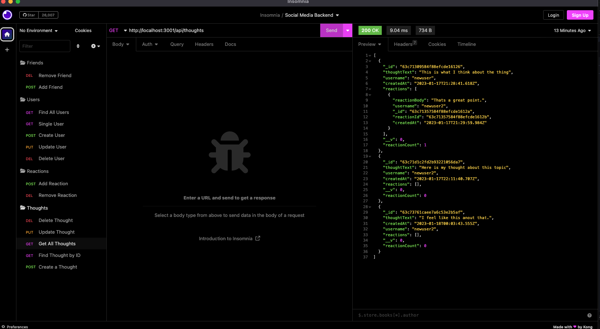

# social-network-api

## Description

This project contains the back-end code for a social network API using a NoSQL database. It allows users to posts thoughts, add friends, and react to each other's thoughts. 

## Table of Contents

  - [Installation](#installation)
  - [Usage](#usage)
  - [License](#license)
  - [Questions](#questions)

## Installation 

This app uses the following technologies by running node server.js in your terminal.

## Usage

Video walk through is [here](https://drive.google.com/file/d/1bfQ77xYCyA3mgqbSf74k005egdPTsEZz/view)

Below is a screenshot of insomnia:

## License

This application uses the MIT license.
  
MIT: https://choosealicense.com/licenses/mit/

## Questions

If you have any questions about the repo, open an issue or 
contact me directly at ryanmbelcher86@gmail.com. You can find more of my work on [GitHub](https://github.com/ryanmbelcher).

